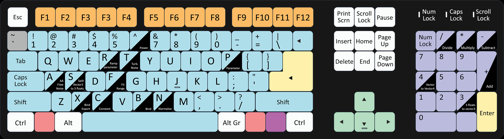

# Autohotkey
Script files to use with [Autohotkey](http://www.autohotkey.com)  

 ## [Houdini Autohotkey file](Houdini_Hotkeys.ahk)
 It contains:  
 - all the hotkeys to react like unreal hotkeys  
 - a nice shortcut to add hotkeys for copy (CTRL+SHIFT+C) / paste (CTRL+SHIFT+V) as relative reference  
 - a hotkey with the key **<** (for azerty keyboard) to make the left button react like middle button on my notepad when I press that touch.  
 
## Keyboard Hotkey Mapping 

You can find more info on my website http://fxtd.free.fr/index.php/wiki/lmb-hotkeys-like-unreal/
